<picture>
  <source media="(prefers-color-scheme: dark)" srcset="profile/dark.svg">
  
</picture>

### `$ cat ~/.stack`


### `$ ./snake --eat contributions`

<picture>
  <source media="(prefers-color-scheme: dark)" srcset="profile/snake-dark.svg">
  
</picture>

### `$ cat /var/log/visitors | wc -l`


```text
$ ./life
Segmentation fault (core dumped)   # 然后开始 debug
```

<details>
<summary><code>$ cat .secret</code></summary>

```text
$ cat .secret
cat: .secret: Permission denied
$ sudo cat .secret
[sudo] password for koko:
koko is not in the sudoers file. This incident will be reported.
```

没拿到权限也没关系，答案其实早就写在上面的 backtrace 里了：`life.cpp:42`。

</details>
